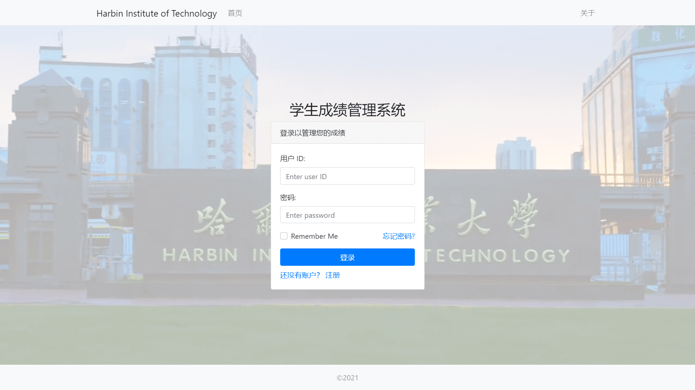
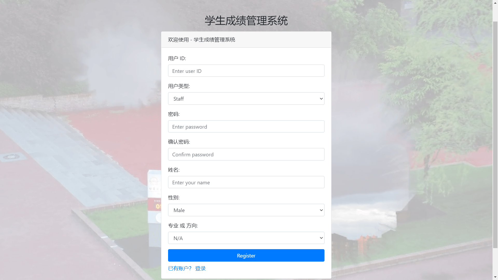
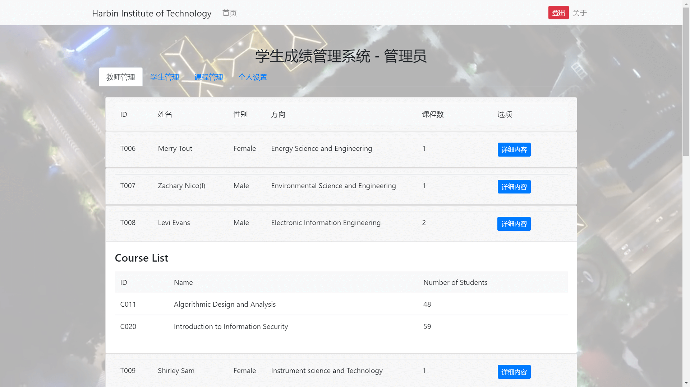
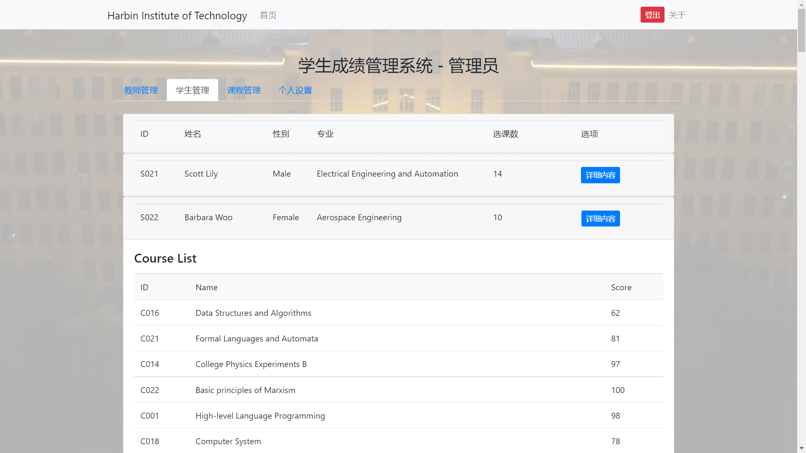
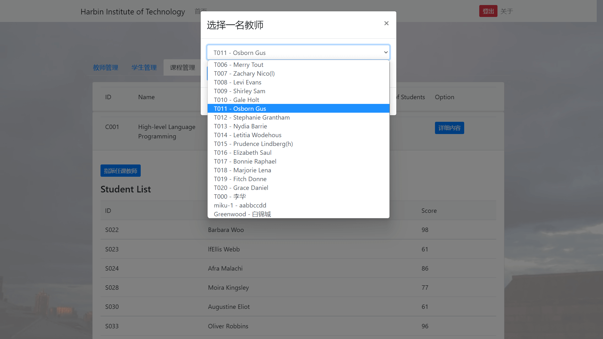
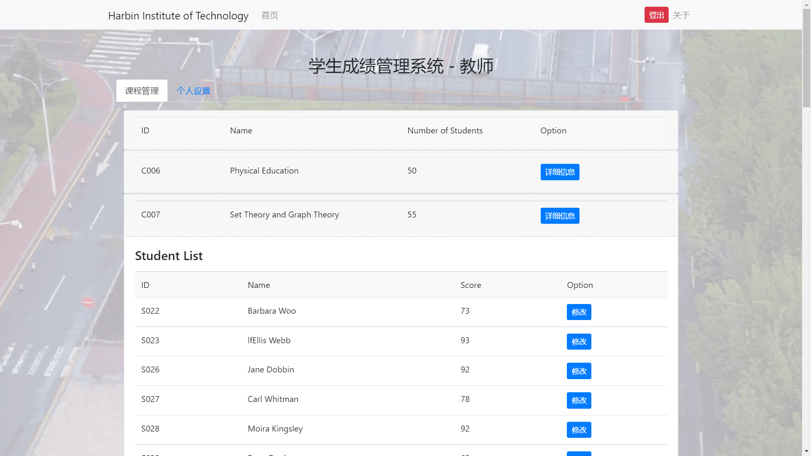
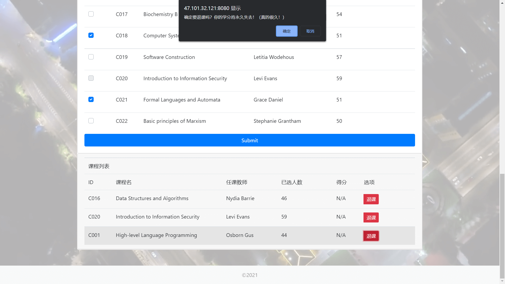
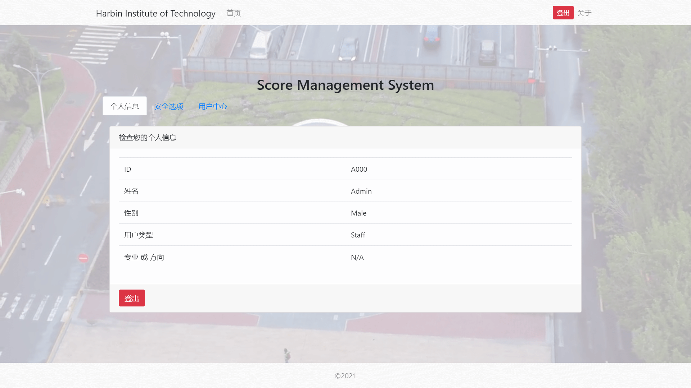
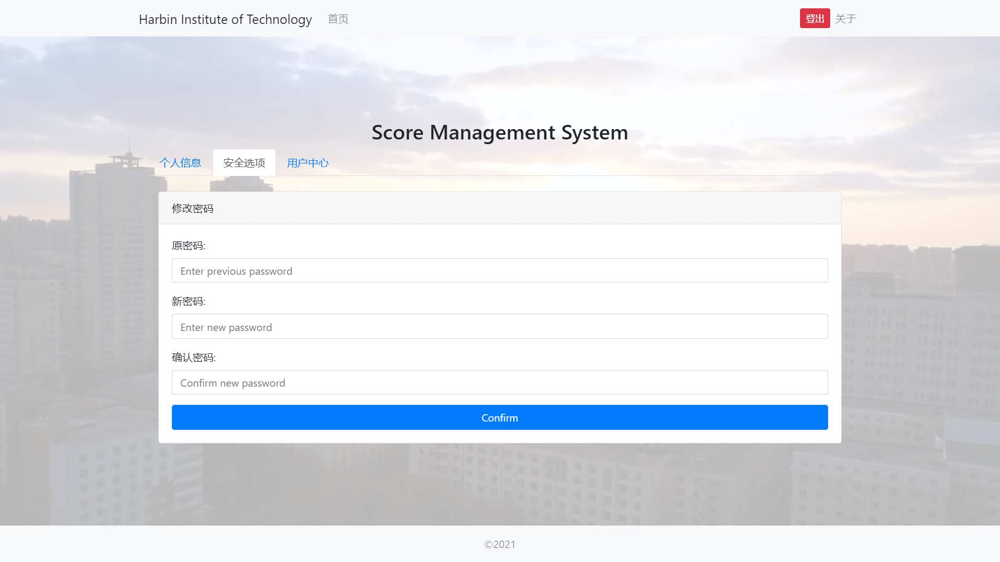
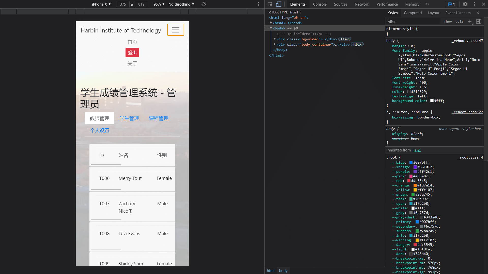

# 《基于Java EE平台的软件开发》大作业报告

<table>
<tr>
<td>项目名称</td>
<td  colspan="6">哈工大学生成绩管理系统（HIT Score Management System）</td>
</tr>
<tr>
<td rowspan="2">评分项目</td>
<td>工作量<br>40%</td>
<td>完成度<br>20%</td>
<td>分工<br>20%</td>
<td>设计<br>10%</td>
<td>界面<br>10%</td>
<td>总分<br>100%</td>
</tr>
<tr>
<td>&nbsp;</td>
<td> </td>
<td></td>
<td></td>
<td></td>
<td></td>
</tr>
<tr>
<td>学号</td>
<td>姓名</td>
<td colspan="3">具体分工</td>
<td>贡献排名</td>
<td>个人得分</td>
</tr>
<tr>
<td>120L021403</td>
<td>冯新航</td>
<td colspan="3">表示层（前端，JSP）</td>
<td>1</td>
<td></td>
</tr>
<tr>
<td>120L022324</td>
<td>刘文君</td>
<td colspan="3">业务逻辑层（Servlet）</td>
<td>2</td>
<td></td>
</tr>
<tr>
<td>120L021701</td>
<td>张晨曦</td>
<td colspan="3">数据处理层（UserDao、DBUtils）</td>
<td>3</td>
<td></td>
</tr>
<tr>
<td>120L021006</td>
<td>唐果</td>
<td colspan="3">数据处理层（UserDao、DBUtils）</td>
<td>4</td>
<td></td>
</tr>
</table>
在线阅读源码：

+ Github: https://github.com/vonbrank/HIT-CS33114-final-assignment
+ Gitee: https://gitee.com/vonbrank/HIT-CS33114-final-assignment

项目已部署至：http://47.101.32.121:8080/score-management-system/

提供测试账户：

+ `userid`: `A000` ； `password`: `123456`
+ `userid`: `T000` ； `password`: `123123`
+ `userid`: `S110` ； `password`: `qwerty`

## 项目整体功能描述（至少100字）：

### 工程结构

#### 目录树

```
│  .gitignore
│  HIT-CS33114-final-assignment.iml
│  README.md
│
├─.idea
│  │  .gitignore
│  │  misc.xml
│  │  modules.xml
│  │  runConfigurations.xml
│  │  saveactions_settings.xml
│  │  uiDesigner.xml
│  │  vcs.xml
│  │  workspace.xml
│  │
│  └─artifacts
│          HIT_CS33114_final_assignment_war_exploded.xml
│
├─docs
│  │  intro.md
│  │  report.md
│  │  大作业任务.doc
│  │  大作业分组.xls
│  │  大作业报告.doc
│  │
│  └─img
│          education-system.drawio
│          education-system.png
│
├─lib
│      mysql-connector-java-8.0.26.jar
│
├─src
│  └─cn
│      └─edu
│          └─hit
│              └─edusys
│                  ├─controller
│                  │      CourseServlet.java
│                  │      LoginServlet.java
│                  │      UserServlet.java
│                  │
│                  ├─dao
│                  │  │  CourseDao.java
│                  │  │  UserDao.java
│                  │  │
│                  │  └─impl
│                  │          CourseDaoImpl.java
│                  │          UserDaoImpl.java
│                  │
│                  ├─entity
│                  │  ├─course
│                  │  │      Course.java
│                  │  │      Score.java
│                  │  │
│                  │  └─user
│                  │          Staff.java
│                  │          Student.java
│                  │          Teacher.java
│                  │          User.java
│                  │
│                  └─utils
│                          DBUtils.java
│
└─web
    │  index.jsp
    │
    ├─admin
    │  │  index.jsp
    │  │
    │  └─courses
    │      │  index.jsp
    │      │
    │      ├─modify
    │      │      index.jsp
    │      │
    │      └─scores
    │              index.jsp
    │
    ├─auth
    │  ├─login
    │  │      index.jsp
    │  │
    │  └─register
    │          index.jsp
    │
    ├─user
    │  ├─profile
    │  │      index.jsp
    │  │
    │  ├─staff
    │  │      index.jsp
    │  │
    │  ├─student
    │  │  │  index.jsp
    │  │  │
    │  │  └─courses
    │  │          index.jsp
    │  │
    │  └─teacher
    │      │  index.jsp
    │      │
    │      └─courses
    │          │  index.jsp
    │          │
    │          └─modify
    │                  index.jsp
    │
    └─WEB-INF
        │  web.xml
        │
        ├─classes
        │
        └─lib
                mysql-connector-java-8.0.26.jar
```

#### 流程图

**注：项目迭代过程中，少数节点逻辑更变，实际以源码为准。**


### 前端说明

使用bootstrap框架和响应式设计。

#### `./` 

主页。


#### `./auth/login/`

登录页。

实现：
+ 引导用户进行注册
+ 登录验证
+ 密码错误提示
+ 重置密码成功提示
+ 非法登录重定向提示
+ 对忘记密码者的人文关怀


#### `./auth/register/`

注册页。

实现：
+ 三种类型的用户注册
+ 用户名重复检测
+ 二次输入密码一致性检测
+ 限制密码字符种类防止SQL注入
+ 信息缺失检测
+ 管理员无专业检测
+ 师生有专业检测


#### `./user/staff/`

管理员用户中心。


##### `./user/staff/#teacher-management`

列出所有教师信息。


##### `./user/staff/#student-management`

列出所有学生信息。


##### `./user/staff/#course-management`

列出所有课程信息。

实现：

+ 指派老师
+ 查询学生成绩


#### `./user/teacher/`

教师用户中心。


##### `./user/teacher/#course-management`

列出教师所教课程信息，包括选择该课程的学生。

实现：
+ 弹出模态框，录入学生成绩。


#### `./user/student/`

学生用户中心。

##### `./user/student/#course-management`

列出学生所教课程信息。

实现：
+ 学生选课。


#### `./user/profile/`

个人信息管理，对三种用户都有效。


##### `./user/profile/#personal-info`

列出个人信息信息。

实现：
+ 登出。

等功能

##### `./user/profile/#security-options`

安全选项

实现：
+ 重置密码，并重定向至登录页。

等功能


### 后端接口、方法说明

**注：项目迭代过程中，少数接口功能更变，实际以源码为准。**

#### `cn.edu.hit.sms.controller.*`

##### `LoginServlet`

用于处理关于登录信息的请求；维护系统的安全。

##### `UserServlet`

用于处理关于用户信息的请求。

##### `CourseServlet`

用于处理关于课程信息的请求。

#### `cn.edu.hit.sms.entity.*`

##### `User`类：

`User`类是所有用户类的基类，包含每个用户的编号、姓名、性别和用户类型，以及其`Getter`和`Setter`方法。

| 字段                     | 说明                                                                 |
| ------------------------ | -------------------------------------------------------------------- |
| `private String id;`     | 用户的编号、学号。                                                   |
| `private String name;`   | 用户的姓名。                                                         |
| `private String gender;` | 用户的性别。                                                         |
| `private int userType;`  | 用户的类型。<br>错误的类型值输入需抛出`IllegalArgumentException`异常 |

`userType`值与用户类类型对应关系如下：

| 值  | 对应类    |
| --- | --------- |
| `0` | `Staff`   |
| `1` | `Teacher` |
| `2` | `Student` |

##### `Staff`类：

`Staff`类是管理员类，完全继承自`User`类，没有额外字段。

##### `Teacher`类：

`Teacher`类是教师类，有额外字段`private String profession;`表示其研究方向。

##### `Student`类：

`Student`类是学生类，有额外字段`private String major;`表示其所属专业。

#### `cn.edu.hit.sms.dao.*`

##### `UserDao`接口：

`UserDao`用以操作、查询数据库中所有用户的信息，包括`Staff`, `Teacher`和`Student`。

| 接口原型                              | 说明                     |
| ------------------------------------- | ------------------------ |
| `public User getById(String id);`     | 以`id`获取单个用户。     |
| `public User getByName(String name);` | 以名字`name`获取单个用户 |
| `public int add(User user);`          | 添加一个用户。           |
| `public int modify(User user);`       | 修改一个用户。           |
| `public int remove(String id);`       | 移除一个用户。           |

##### `CourseDao`接口：

`CourseDao`用以操作和查询数据库中所有课程信息，和所有学生关于其课程的得分记录。

| 接口原型                                              | 说明                                            |
| ----------------------------------------------------- | ----------------------------------------------- |
| `public List<Course> getAllCourses();`                | 获取所有课程。                                  |
| `public Course getCourseByCid(String cid);`           | 以课程`id`获取一个课程。                        |
| `public Course getCourseByCname(String cname);`       | 以课程名`cname`获取一个课程。                   |
| `public List<Course> getCourseByTid(String tid);`     | 以任课教师的`id`获取一个课程。                  |
| `public List<Course> getCourseByTname(String tname);` | 以任课教师姓名`tname`获取一个课程。             |
| `public int addCourse(Course course);`                | 添加一个课程。                                  |
| `public int modifyCourse(Course course);`             | 修改一个课程。                                  |
| `public int removeCourse(String id);`                 | 移除一个课程。                                  |
| `public List<Score> getAllScores();`                  | 获取所有得分记录。                              |
| `public List<Score> getScoreBySid(String sid);`       | 以学号`sid`获取一个学生所有课程的得分。         |
| `public List<Score> getScoreBySname(String sname);`   | 以姓名`sname`获取一个学生所有课程的得分。       |
| `public List<Score> getScoreByCid(String cid);`       | 以课程`cid`获取一个课程下所有学生的得分。       |
| `public List<Score> getScoreByCname(String cname);`   | 以课程名称`cname`获取一个课程下所有学生的得分。 |
| `public int addScore(Score Score);`                   | 添加一条得分记录。                              |
| `public int modifyScore(Score score);`                | 修改一条得分记录。                              |
| `public int removeScore(Score Score);`                | 移除一条得分记录。                              |

#### `cn.edu.hit.sms.utils.*`

##### `DBUtils`

| 字段与方法名                                        | 解释                 |
| --------------------------------------------------- | -------------------- |
| `static final String JDBC_DRIVER;`                  | JDBC驱动名           |
| `static final String DB_URL;`                       | 数据库地址           |
| `static final String USER;`                         | 数据库登录用户       |
| `static final String PASS;`                         | 数据库登录密码       |
| `private static Connection con;`                    | 获取连接             |
| `private static Statement stmt;`                    | Statement对象        |
| `public static ResultSet executeQuery(String sql);` | 获取查询语句的结果集 |
| `public static int executeUpdate(String sql);`      | 更新数据库           |
| `public static void close();`                       | 关闭连接             |


## 程序运行步骤描述及截图（按不同角色的用户展示其功能）：

### 主页

未登录状态：


已登录状态:


### 登录页



### 注册页



### 管理员页

教师管理



学生管理



教师指派



### 教师页

查询，修改成绩



### 学生页

学生选课退课



### 个人设置

查看个人信息



重置密码



### 响应式设计

导航栏自动折叠，表格生成横向滚动条

